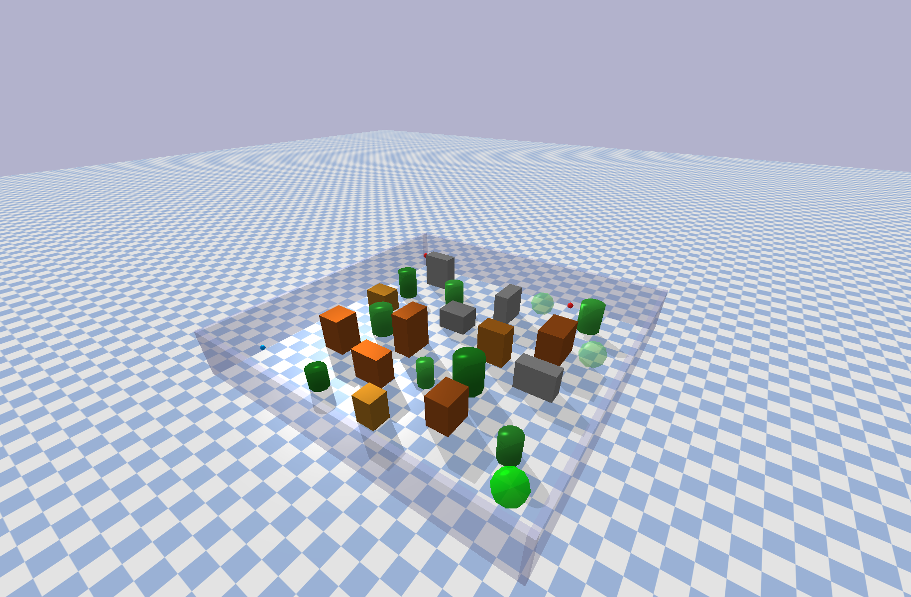
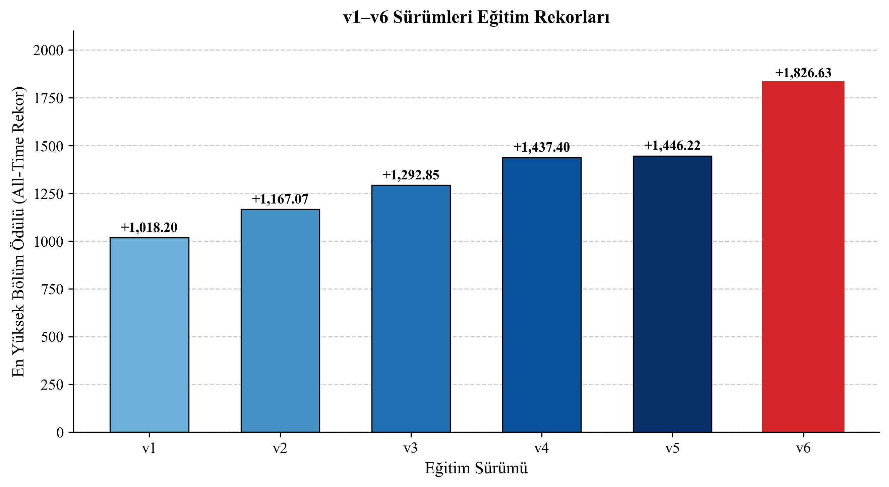
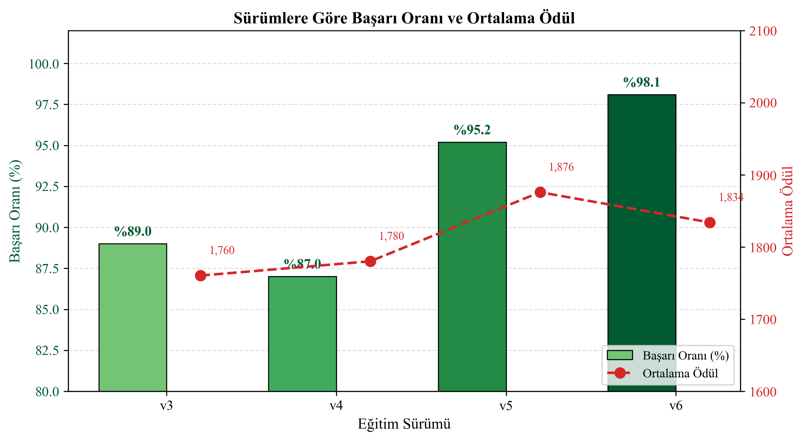
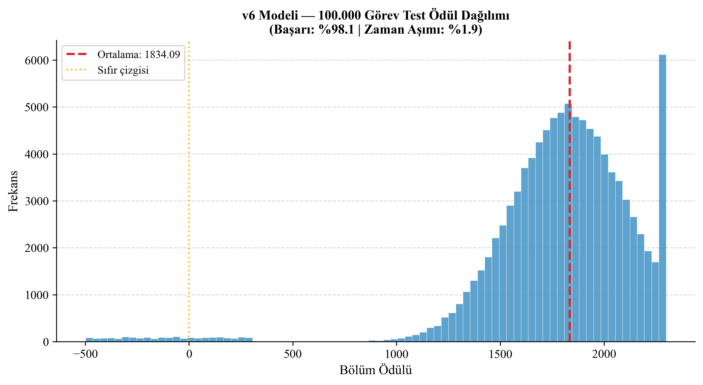
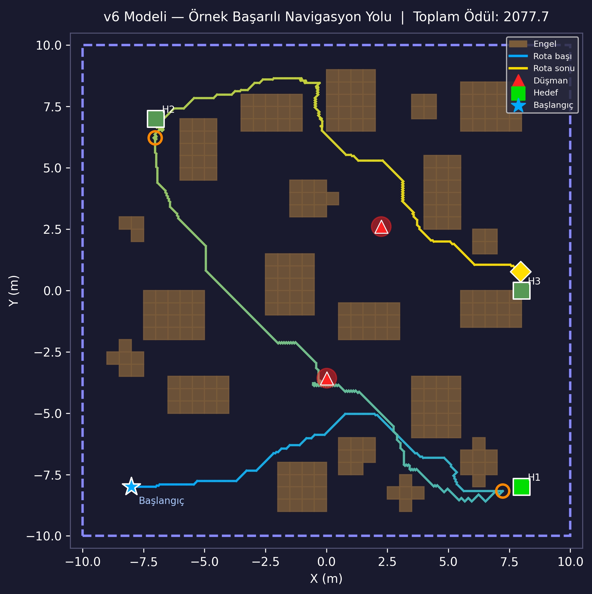
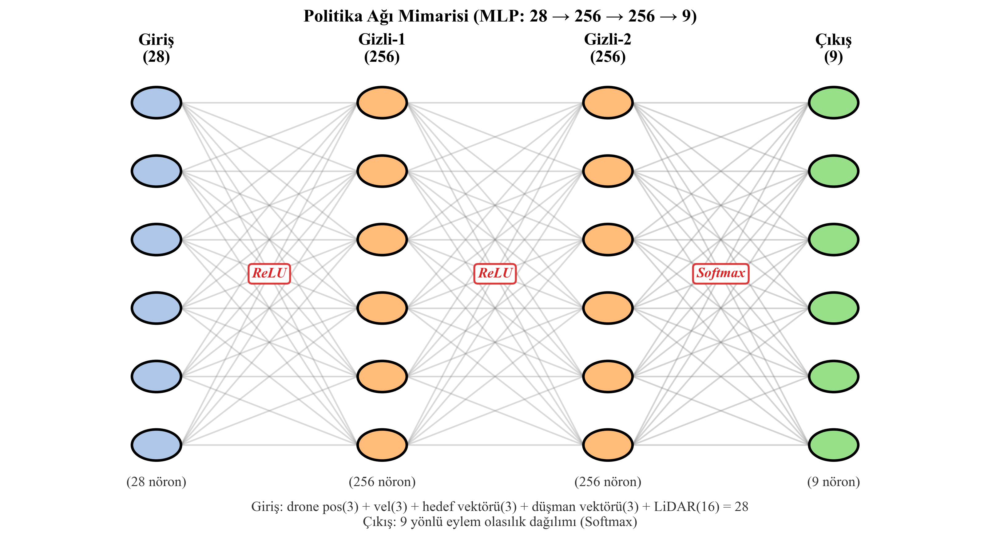

<p align="right">
  🇹🇷 Türkçe &nbsp;|&nbsp; <a href="README.en.md">🇺🇸 English</a>
</p>

# IHA Rota — Pekiştirmeli Öğrenme ile 3B Otonom İHA Navigasyonu

PyBullet fizik simülasyonunda REINFORCE (Monte Carlo Politika Gradyanı) algoritması ile eğitilmiş; 3B ortamda engellerden ve düşman ajanlardan kaçarak sıralı hedeflere ulaşan otonom bir insansız hava aracı.

> 🥉 **Fakülte 3.'sü** — Fırat Üniversitesi Mühendislik Fakültesi, Bitirme Projesi Yarışması 2026

---

## Demo



20×20 metrelik 3B arena:
- Rastgele konumlandırılmış 10 **engel** (kutu + silindir)
- Aktif takip yapan 2 **düşman ajan**
- Sırayla ulaşılması gereken 3 **hedef**
- 16 ışınlı **LiDAR** sensörü

---

## Sonuçlar

### Eğitim Rekorları (v1 → v6)



### Başarı Oranı Karşılaştırması



### Final Model (v6) — 100.000 Görev Testi

| Metrik | Değer |
|---|---|
| Ortalama Ödül | 1834,09 |
| Maksimum Ödül | 2298,95 |
| Eğitim Rekoru | +1826,63 |
| **Başarı Oranı** | **%98,1** |
| Zaman Aşımı | %1,9 |
| Toplam Test Görevi | 100.000 |

v6 modeli, v5 üzerinden ~13.700 sorti daha eğitilerek sorti 8.300'de **+1826,63** tüm zamanların rekoruna ulaştı ve ardından platoya girdi. İki ayrı v7 denemesi (daha düşük öğrenme hızlarıyla) bu rekoru geçemedi; v6 final model olarak benimsendi.

### Ödül Dağılımı (100K görev)



### Örnek Navigasyon Yolu



---

## Politika Ağı Mimarisi



- **Girdi:** 28 boyut (drone konum/hız, göreceli hedef vektörü, göreceli düşman vektörü, 16× LiDAR)
- **Gizli katmanlar:** 256 → 256 (ReLU)
- **Çıktı:** 9 ayrık hareket yönü (Softmax)
- **Toplam parametre:** ~75.500

---

## Kurulum

```bash
conda create -n iha_env python=3.10
conda activate iha_env
pip install pybullet gymnasium torch numpy matplotlib
```

---

## Kullanım

### Eğitim

```bash
python train.py
```

Versiyon yönetimi `config.py` içindeki `VERSION` ve `BASE_VERSION` değişkenleriyle yapılır.  
Yeni rekor kırıldığında model `sonuc/vX_iha_beyni.pth` olarak kaydedilir.

### Test (görsel, 5 sorti)

```bash
python test.py
```

### Uzun test (100 sorti, istatistikli)

```bash
python uzun_test.py
```

### Stres testi (30 engel, zorlu senaryo)

```bash
python test_zor.py
```

### Kaggle'da Eğitim

`kaggle_train.ipynb` dosyasını Kaggle notebook olarak çalıştırın. Bu kurulum için GPU'dan CPU modu daha hızlı çalışmaktadır.

---

## Dosya Yapısı

```
iha_rota/
├── config.py              # Tüm hiperparametreler ve ortam ayarları
├── train.py               # REINFORCE eğitim döngüsü
├── test.py                # 5 sortili görsel test
├── uzun_test.py           # 100 sortili uzun test + istatistik
├── test_zor.py            # 30 engelli stres testi
├── kaggle_train.ipynb     # Kaggle eğitim notebook'u
├── env/
│   ├── iha_env.py         # Ana Gymnasium ortamı
│   ├── obstacles.py       # Engel yerleşimi
│   ├── enemies.py         # Düşman ajan davranışı
│   └── boundary_walls.py  # Arena sınır duvarları
├── network/
│   └── policy.py          # IhaPolicy ağı (28→256→256→9)
├── visualization/
│   └── viz_2d.py          # Gerçek zamanlı 2B kuş bakışı görselleştirme
├── sonuc/                 # Eğitilmiş modeller (v1–v6)
└── assets/                # README görselleri
```

---

## Algoritma

**REINFORCE** (Williams, 1992) — Monte Carlo Politika Gradyanı

- Her bölüm sonunda tam geri dönüş hesabı (γ = 0,99)
- Varyans azaltma için normalize edilmiş getiri
- Keşif teşviki için entropi bonusu (v1–v5: 0,05, v6: 0,02)

---

## Eğitim Geçmişi

| Versiyon | Baz | Öğrenme Hızı | Entropi | Rekor |
|---|---|---|---|---|
| v1 | sıfırdan | 2×10⁻⁴ | 0,05 | +1018,20 |
| v2 | v1 | 2×10⁻⁴ | 0,05 | +1167,07 |
| v3 | v2 | 2×10⁻⁴ | 0,05 | +1292,85 |
| v4 | v3 | 2×10⁻⁴ | 0,05 | +1437,40 |
| v5 | v4 | 2×10⁻⁴ | 0,05 | +1446,22 |
| **v6** | v5 | **1×10⁻⁴** | **0,02** | **+1826,63** ✓ |

Kaggle CPU ortamında toplam ~65.000 sorti.

---

## Gereksinimler

- Python 3.10
- PyTorch ≥ 1.13
- PyBullet ≥ 3.2.5
- Gymnasium ≥ 0.26
- NumPy, Matplotlib

---

## Lisans

[MIT](LICENSE)
